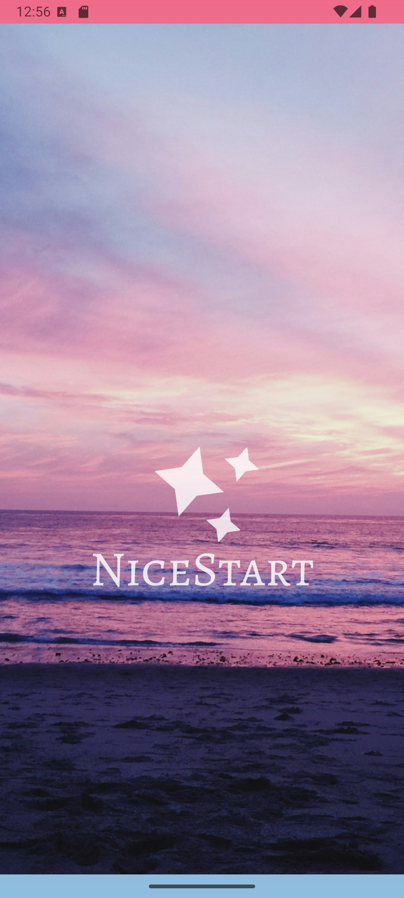

# Proyecto NiceStart Min Wang
 

## Pantalla de login: 

En la pantalla de login, se puede observar que hay una opcion de hacer login directamente 
introduciendo el username y la contraseña o en caso de ser nuevo usuario, dandole al boton
de sign up podras crearte una cuenta.
### Codigo Java

Aqui podemos ver como se haria un redirect cuando le damos a un boton u otro.
### Codigo de botones 

## Pantalla de sign up:

Una vez dentro de la pantalla de sign up, se observa que para poder crearse una cuenta
será obligatorio meter un nombre de usuario, una contraseña y un mail. 

### Otros detalles :

Os dejo el codigo que se haria en el Manifest de como se harían los actionBar.

Así es como se vería el login y el sign up en horizontal, todo tendría las mismas
funcionalidades como si estuviera en vertical.
## Perfil:

Una vez entrado registrado o habiendo hecho login, aparecerá la pestaña de
perfil donde aparece tu nombre y apellido y la foto de perfil escogida.

### Foto redonda:

Aquí está el codigo de como se haria lo de la foto de perfil y de como 
dejarla circular

## Pantalla de carga

Se ha añadido una pantalla de carga

