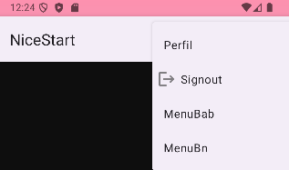

# Proyecto NiceStart Min Wang
 

## Pantalla de login: 

En la pantalla de login, se puede observar que hay una opcion de hacer login directamente 
introduciendo el username y la contraseña o en caso de ser nuevo usuario, dandole al boton
de sign up podras crearte una cuenta.
### Codigo Java

Aqui podemos ver como se haria un redirect cuando le damos a un boton u otro.
### Codigo de botones 

## Pantalla de sign up:

Una vez dentro de la pantalla de sign up, se observa que para poder crearse una cuenta
será obligatorio meter un nombre de usuario, una contraseña y un mail. 

### Otros detalles :

Os dejo el codigo que se haria en el Manifest de como se harían los actionBar.

Así es como se vería el login y el sign up en horizontal, todo tendría las mismas
funcionalidades como si estuviera en vertical.
## Perfil:

Una vez entrado registrado o habiendo hecho login, aparecerá la pestaña de
perfil donde aparece tu nombre y apellido y la foto de perfil escogida.

### Foto redonda:

Aquí está el codigo de como se haria lo de la foto de perfil y de como 
dejarla circular

## Pantalla de carga

https://github.com/user-attachments/assets/c9e00eae-bf65-4d55-ac94-1f1263eff72d
Se ha añadido una pantalla de carga

#### Codigo Splash (Pantalla de carga)
En mi caso he utilizado una url de internet, para que se pueda usar eso
hay que ir al Manifest y ahi añadir el siguiente codigo :
<uses-permission android:name="android.permission.INTERNET" />

## Pantalla Main

En la pantalla de Main se ha añadido un refresh donde cambia de foto
cada vez que se haga y un appbar con dos iconos con opciones,
si le damos al icono de las 3 barras aparecerán las siguientes opciones:

Existe la opción de ir al perfil del usuario y el de Signout que te llevará
al Login del principio por si se quisiera cambiar de usuario o crear 
una cuenta nueva.

Si le damos a la opción del Signout

Como se observa, al darle al botón de Signout, nos aparecen las 3 
opciones siguientes
## Codigo del menu de opciones
Para hacer el menu de opciones, se necesitaria este codigo, pero anteriormente hay que
haber creado en un directorio menu las opciones del appbar para poder llamarlas desde
el main de java, en dicho codigo faltaria el return que seria  return super.onOptionsItemSelected(item);
y cerrar la llave del public boolean

## Codigo Refresh
Este codigo es el que habria que escribir en el main para que se pueda
hacer el refresh, pero para ellos habria que añadir una libreria externa
ya que no esta incluida. la libreria es la siguiente:
implementation("androidx.swiperefreshlayout:swiperefreshlayout:1.1.0")

## Codigo Signout
Para este codigo hay que meter un builder con las opciones que se quiera
añadir

